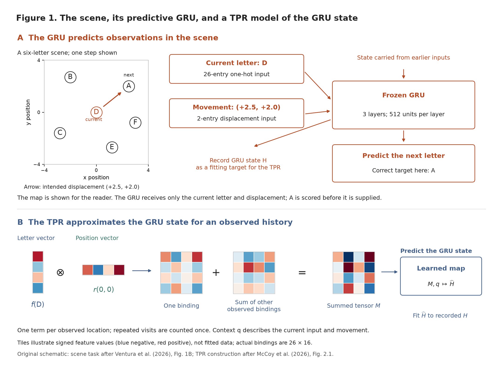
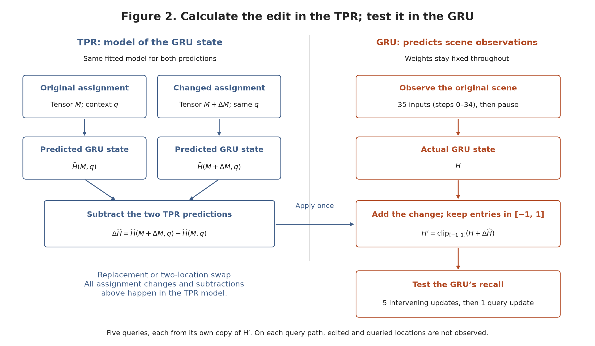
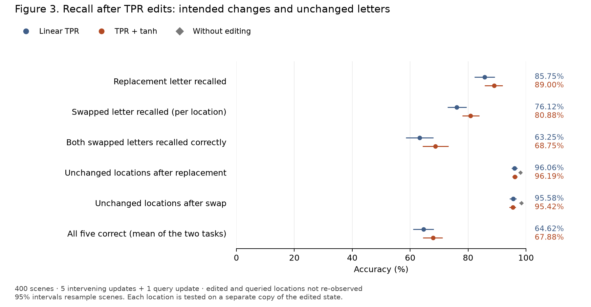

# Editing scene memory with a simple tensor-product representation

**Can a simple model of “which letter is where” explain a recurrent network’s memory well enough to change what it recalls?** We fit a tensor-product representation (TPR) to a trained scene network, calculate changes in that explanatory model, and apply them to the network’s hidden state. The basic linear TPR gets surprisingly far: the network recalls the intended replacement letter in **85.75%** of tests, while accuracy at unchanged locations remains about **96%**. The report follows three figures: **the scene, the GRU, and our model of its state (Figure 1), the intervention test (Figure 2), and the results (Figure 3)**. We first examine the basic TPR, then ask whether adding a bounded nonlinearity, tanh, helps further.

## Why this experiment?

In [Ventura, Bosch, Kietzmann and Thorat’s scene study](https://escholarship.org/uc/item/1mj18812), a recurrent network built from gated recurrent units (GRUs) observes letters one at a time and predicts the next letter from the current letter and a saccade-like displacement. This task requires remembering letters and their locations. We use the **publicly released trained GRU from that study**, available in [the authors’ scene-network repository](https://github.com/KietzmannLab/minimal_world_model_interp); its exact training condition is not documented in the checkpoint itself.

There are three levels here: **the scene is the world; the GRU is trained to predict observations in that world; the TPR is our model of the GRU’s hidden state during that task.** The TPR uses observed letter–position assignments and current processing context to predict a state. We do not give it the task of predicting the GRU’s entire state-update process.

Good next-letter predictions tell us that the network remembers something useful, but not how it organizes that memory. A list of letters alone cannot distinguish “A on the left, B on the right” from the reverse arrangement. We need an explanatory model that keeps track of **which content belongs to which location**.

A TPR makes that hypothesis explicit: represent a letter and a location separately, bind them by an outer product, and add the bindings together. This gives us named parts we can manipulate. Removing one binding and inserting another predicts a particular change in the network’s state; swapping two bindings tests location assignment while keeping the same letters. The purpose of fitting a TPR is therefore to turn a description of scene memory into **testable predictions about how recall should change**.

Following the motivation of [McCoy et al.’s TPR framework](https://arxiv.org/abs/2608.29530v1), we ask both whether these bindings predict recorded GRU states and whether their proposed edits work in the GRU. Agreement on both tests would make the decomposition useful for explaining memory, even if it leaves some recurrent activity unexplained. The GRU’s weights stay fixed throughout.

**Figure 1 connects these three levels.** Panel A shows the scene and the GRU’s prediction task. Panel B shows the TPR approximation of the GRU’s state; it is evaluated against states recorded from the GRU.



**Figure 1 — The scene, its predictive GRU, and our explanatory TPR.** In A, the axes are spatial coordinates, not time. D is the current letter; the arrow moves from (0, 0) to (2.5, 2), where A is the correct next-letter target. The full map is shown only for the reader; input/output projection layers are omitted from this schematic. The GRU is given D and the displacement, and must predict A before A is supplied. In B, a letter vector is multiplied by a position vector to form one binding matrix; these matrices are added over observed locations. Colored cells illustrate signed feature values, with reduced dimensions for legibility; they are not measured activations. The sum, together with current processing context, predicts the recorded GRU state. The notation is defined below.

This original schematic draws on [Ventura et al., Figure 1B](https://escholarship.org/uc/item/1mj18812) and [McCoy et al., Figure 2.1](https://arxiv.org/html/2608.29530v1#S2.F1), using the six-distinct-letter scenes tested here. Ventura et al.’s broader task also allows four or five locations and repeated letters. [Figure PDF](figures/setup.pdf)

## Start with the simplest TPR

For the locations observed so far, bind each letter vector to a position vector and sum:

$$
M=\sum_i f(\ell_i)\otimes r(p_i),\qquad r(p)=R\phi(p).
$$

The sum runs over distinct locations seen so far; repeated visits do not add extra copies. The symbols specify both **what is represented** and **how it is represented**:

| Symbol | Meaning |
| --- | --- |
| $i$, $\ell_i$, $p_i$ | Index of a distinct previously observed location, the letter there, and its two-dimensional position. Positions are integrated from observed movements. |
| $f(\ell_i)$ | Learned 26-dimensional vector for that letter, traditionally called the *filler*. |
| $r(p_i)$ | Learned 16-dimensional vector for that position, traditionally called the *role*. |
| $\phi(p)$, $R$ | A fixed vector of 27 smooth coordinate features at position $p$, and the learned 16 × 27 matrix that converts those features to a role. |
| $\otimes$ | Outer product: multiply every entry of the letter vector by every entry of the position vector, producing a 26 × 16 binding matrix. |
| $M$ | The 26 × 16 tensor obtained by adding all observed bindings. |

For a static scene, one term per observed assignment is the simplest hypothesis to test. The shared coordinate features let roles vary smoothly across continuous positions, without a separate fitted role for every location in every scene.

We then predict the GRU’s hidden state from the tensor and current processing context:

$$
\widehat H(M,q)=\beta+Uq+W\,\mathrm{vec}(M).
$$

| Symbol | Meaning |
| --- | --- |
| $H$, $\widehat H$ | The actual GRU state and the TPR model’s predicted state. Each has 1,536 entries: three layers of 512 units, concatenated. The hat marks a prediction. |
| $\mathrm{vec}(M)$, $W$ | The binding matrix flattened into 416 entries, and the learned 1,536 × 416 matrix translating them into GRU-state coordinates. |
| $q$, $U$ | An 84-entry context vector and its learned 1,536 × 84 map into the same state coordinates. Context includes the current letter, current and next positions, outgoing displacement, step number and number of locations seen; never the queried-letter answer. |
| $\beta$ | A learned 1,536-entry bias vector. |

The context term allows ordinary effects of the current input and movement to be explained separately from the stored assignments. During a binding edit, we keep this context fixed. [Exact features, scaling and dimensions](docs/METHODS.md#representation-and-training)

We fit this **model of the GRU** using recorded GRU states, plus the differences between states produced by running the same viewing sequence on original and changed scenes. There are 1,000 training and 250 validation scenes. Only the TPR model is fitted; the GRU is never retrained.

## Test the model by changing recall

At step 34 (counting from zero), after 35 input updates, choose familiar locations with at least three visits, excluding the current location and the already-specified next destination. Make either change **in the TPR**:

- **Replacement:** at position $p$, replace letter $a$ with a letter $b$ absent from the scene. The tensor change is $\Delta M=[f(b)-f(a)]\otimes r(p)$.
- **Swap:** exchange letters $a,b$ at positions $p,s$. The tensor change is $\Delta M=[f(b)-f(a)]\otimes[r(p)-r(s)]$. Keeping the same letters makes this a test of their assignments to locations.

Here $a$ and $b$ name letters, $p$ and $s$ name positions, and $\Delta M$ is the changed tensor minus the original tensor. Next, calculate $\Delta\widehat H$, the difference between the TPR model’s two state predictions:

$$
\Delta\widehat H=\widehat H(M+\Delta M,q)-\widehat H(M,q).
$$

**Both predictions and their subtraction are computed in the explanatory TPR model.** We then add that predicted difference to the actual GRU state $H$:

$$
H'=\mathrm{clip}_{[-1,1]}(H+\Delta\widehat H).
$$

$H'$ is the edited GRU state. The clipping operation sets any entry below −1 to −1, any entry above 1 to 1, and leaves other entries unchanged, keeping the state within the GRU’s range. We do not subtract a separately recorded “changed-scene” GRU state, or replace the entire state with the TPR prediction. This tests whether the change proposed by the TPR has the intended effect on the GRU’s behavior.

Let the edited GRU take five intervening updates, then one further update with a movement directed at the queried location. Score its prediction before supplying the letter there. No update on this path supplies a letter from an edited location or the queried location. Test each location on a separate copy of the edited state, so one query cannot teach an answer to another. Score five locations: one replacement and four unchanged locations, or two swapped and three unchanged locations. The already-specified next destination is excluded because it must immediately be observed. [Exact timing and code](docs/METHODS.md#intervention-and-probe-timing)

**Read Figure 2 from left to right:** the blue side computes both predictions and their subtraction using the same fitted TPR. Only the resulting difference crosses to the orange side, where it is added once to the actual GRU state. Recall is then tested using separate copies of that edited state. This procedure applies to both the linear and tanh models.



**Figure 2 — Analysis setup.** Arrows trace the calculation: change the TPR assignment, subtract its two predictions, add the difference to the GRU, and test recall. Both TPR predictions use the same fitted weights and context. The GRU starts from its actual state after 35 inputs; it is edited once, then each of five queried locations is tested from a separate copy. [Figure PDF](figures/methods.pdf)

## How well does the basic TPR do?

On **400 test scenes not used for fitting or selection**, each containing six distinct letters:

| GRU recall after an edit proposed by the linear TPR | Accuracy |
| --- | ---: |
| Intended replacement letter | **85.75%** |
| Intended swapped letter, averaged over the two locations | **76.1%** |
| Both swapped letters correct, testing each on a separate copy | **63.25%** |
| Unchanged letters after replacement | **96.06%** |
| Unchanged letters after swapping | **95.58%** |

Without editing, accuracy on those unchanged locations is 98.13% and 98.42%, respectively. Thus, the TPR makes substantial, fairly selective changes to recall, with a two-to-three-point cost at other locations. As a reference, if the GRU actually experiences the changed scene from the beginning, it scores 99.50% on replacements and 98.38% per swapped location. There is still room to improve the artificial edits.

**Does the TPR also predict the right representation?** Rearrange three familiar letters to create six assignments with the same positions and viewing sequence. For each predicted state, ask whether its matching actual GRU state is closer than the other five. The linear TPR identifies the correct assignment **90.28%** of the time, versus 16.67% chance, across 398 eligible scenes from a separate 400-scene set. Its state R² is **0.594**: predicting with the TPR reduces total squared state error by 59.4% relative to always predicting the training-set mean state. This measures numerical fit, whereas the six-way test asks whether the prediction identifies the right assignment.

However, if we replace the *entire* GRU state with the TPR prediction, the next-letter answer agrees with the original GRU’s answer only **47.75%** of the time. This is a different test from adding a predicted change to the real state: adding a change retains the parts of the real state that the TPR does not explain. The model captures useful assignment structure without yet accounting for the whole recurrent state.

## Does tanh help further?

The GRU’s hidden-state entries lie in $[-1,1]$, whereas a linear TPR prediction can extend beyond that range. To respect this constraint, we fit a second model that applies **tanh after the complete sum**:

$$
\widehat H_{\mathrm{tanh}}(M,q)=\tanh\left(\beta+Uq+W\,\mathrm{vec}(M)\right).
$$

Here $\tanh$ is the hyperbolic tangent, applied separately to each entry of the predicted sum; it smoothly maps any real value into (−1, 1). The subscript on $\widehat H_{\mathrm{tanh}}$ identifies this second model. The letter–position decomposition stays the same. Tanh adds no parameters and is included during fitting. We still subtract the two model predictions and add their difference to the actual GRU state. The final clipping step is used for **both** models; it is separate from bounding the predictions with tanh.

| Measure | Basic linear TPR | TPR with tanh |
| --- | ---: | ---: |
| Replacement letter recalled | 85.75% | **89.00%** |
| Swapped letter recalled, per location | 76.1% | **80.9%** |
| Both swapped letters correct | 63.25% | **68.75%** |
| Unchanged letters after replacement | 96.06% | 96.19% |
| Unchanged letters after swapping | 95.58% | 95.42% |
| Correct assignment among six state alternatives | 90.28% | 91.75% |
| State R² | 0.594 | 0.620 |
| Same next-letter answer after replacing the entire state | 47.75% | 64.25% |

Tanh improves replacement accuracy by **3.25 percentage points** (95% interval: 1.00–5.50) and swap accuracy per location by **4.75 points** (2.88–6.75). Accuracy at unchanged locations stays similar. These intervals compare the models on the same scenes and resample scenes, not individual queries. [All results](results/audited.json) · [CSV](results/metrics.csv)

Figure 3 separates **changing the intended answers** (first three rows) from **preserving other answers** (next two). Look first for the orange points to the right of the blue points in the first three rows: tanh helps the requested changes. Then compare the preservation rows with the gray diamonds: both edits still cost some accuracy relative to leaving the GRU untouched.



**Figure 3 — Results and how to read them.** The horizontal axis is accuracy in percent; farther right means more correct answers. The vertical axis lists different scoring rules, not a numerical variable. Dots show average scores across 400 scenes; horizontal bars show 95% intervals from 4,000 scene-bootstrap resamples. Blue denotes the basic linear TPR and orange the tanh model. Gray diamonds show unedited-GRU accuracy on the unchanged locations. Numbers at the right give the corresponding dot values. The last row is stricter: all five queried locations must be correct, including unchanged letters. We calculate this separately for replacement and swap, then average the two task scores. Each query is tested on its own copy of the state; “both” and “all five” combine those independent-copy outcomes for the same scene. [Figure PDF](figures/results.pdf)

Both models have 770,644 parameters. The tanh configuration was selected using validation results within an earlier 18-specification study; this focused report presents it alongside the matched linear control. [Selection record](results/original_selection.json) · [Original study configuration](configs/original_study.json)

## What does this tell us?

We fitted a TPR to ask whether an explicit “which letter belongs where” description could **explain and control** the GRU’s memory. We learned that this simple decomposition is useful in both senses: it distinguishes the correct assignment among alternatives, and its proposed state changes make the GRU recall different assignments with substantial selectivity. The swap result matters because the scene contains exactly the same letters; their locations must change in recall.

Thus, the TPR does more than summarize states: it supplies an explicit rule for predicting useful changes to them. A second model that bounds its predictions with tanh improves these results further. At the same time, predicting the entire state remains much harder than proposing a useful edit. This gives us a useful approximation of the GRU’s scene-memory state. It does not yet specify the recurrent process by which the GRU builds, updates, and reads that memory.

It does not yet establish that the GRU literally stores or reads a TPR. Full-dimensional letter vectors can support separate position maps for each letter, and the fitting examples change letters throughout the viewing history, so predicted differences may include effects of past observations. The incomplete prediction of the entire state leaves open whether a static scene-memory component coexists with other recurrent processing. Results also concern one scene-network checkpoint with unverified training-condition provenance.

Next steps are to withhold particular letter–region combinations during fitting, test repeated letters, and test newly learned or overwritten assignments without rewriting past observations. We should also ask whether the GRU reads letters through the fitted factors, and repeat the study on checkpoints with documented training conditions.

## Run it

From this directory, using Python 3.12:

```bash
python3.12 -m venv .venv-scene-tpr
source .venv-scene-tpr/bin/activate
python -m pip install -r requirements.txt
python -m pip install -e .
python -m unittest discover -s tests -v
python scripts/audit_results.py --plot
```

The included results let you reproduce the statistics and comparison plot without downloading the scene network. To run the recall experiments with the fitted TPR models, first download the trained scene network:

```bash
python scripts/fetch_assets.py
python scripts/run.py evaluate --device auto
```

`auto` uses Apple MPS when available and CPU otherwise. See [reproducing the experiments](docs/REPRODUCIBILITY.md) for fitting the TPR models from scratch, and [methods](docs/METHODS.md) for the full experimental specification.

Analysis code is MIT-licensed. See [sources and attribution](THIRD_PARTY.md) for the scene network and related work.

## Acknowledgment

The analyses, code, and report were developed with assistance from GPT 6 Astra, using **medium** and **xhigh** reasoning settings.
